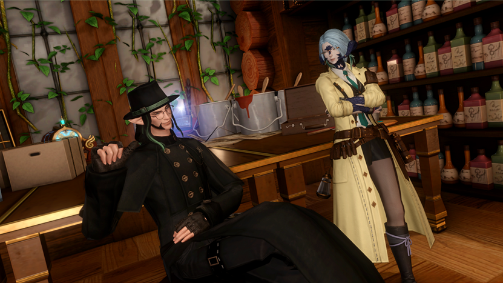

  [下一篇](./守塔人笔记01.md)  [合集](../同人目录.md)

# 守塔人笔记

作者：Arce（mouyains）

* [0](./守塔人笔记00.md)
* [1](./守塔人笔记01.md)
* [2](./守塔人笔记02.md)
* [3](./守塔人笔记03.md)
* [4](./守塔人笔记04.md)
* [5](./守塔人笔记05.md)
* [6](./守塔人笔记06.md)
* [7](./守塔人笔记07.md)
* [8](./守塔人笔记08.md)
* [9](./守塔人笔记09.md)

## 0

从精灵老头儿的葬礼上回来时，我买了这个本子，以后写日记就用它了。

——说是这么说，我未必会每天写。我是个懒人，一个有手写文稿癖好的、懒人，逼着这样一位懒人每天产出文字可是件很残忍的事情，更何况制作这种纸质笔记本的工艺十分古老，纸张价格贵得不容许我随便写写画画再撕去几页，如果按照写实验记录那种流水账的文法来使用这个本子，我迟早要为了这个癖好破产。

大概是有所感悟时，我才会拿出这个本子，写上几笔，以文字记录加深我的记忆。日期未必得写清楚，我只需要知道时间顺序的前后就足够了。

比如今天。这一天，我在这个世界结识到的最投缘的人被烧成了灰。

唉，可惜我与精灵老头儿的关系只到能一起喝酒的好朋友。

这个世界的精灵寿命比起故乡的那些要长上不少。我记得年轻时读的医典上有写过，精灵族，平均寿命估测为一百二十岁，而这位朋友活出了差不多十倍于这寿限的长度。

他的名字叫巴尔契，巴尔契·莱艮德，最初我记住这个拼写的地方是办公室门上挂着的名牌。他劝我给自己的“办公室”也挂个牌子，这样方便别人认门找门。我那时反问他一句，你觉得我该怎么自称呢？我作为一个从其他世界不慎掉入此间的外乡人，拥有的名字不再是地位、权力与人情的钥匙，字母组合间暗含的寓意在这里无人能理解，它仅仅可作为代称，后续还需要以我的言行与交际为名字赋予价值。我或许讨厌我的旧名，或许对它并无特殊感情，也可能我其实深爱着我的旧名，当我心血来潮为自己起了新名字、让别人用另一种方式称呼我、我感到异样时，我才知道我多怀念过去。老东西，你应该也有过这种心血来潮吧？你的情况其实类似，你的生命跨度足够长，长到你可以自然地消失一段时间再出现，偷偷地为自己冠上另一个名字，假装自己开始了新的人生——巴尔契·莱艮德，这是你的本名吗？

“我的名是巴尔契，图书馆地下二层C区战争博物馆316号藏品巴尔契之弓为证据；我的姓莱艮德，用精灵语写就的初版大灯塔建筑设计文稿中便有记载，圣不仁以万物为刍狗，匠(Cræfitga)并猎(Rengen)走，而筑塔。”

当时巴尔契扯了张软凳坐在我办公室的门口，看我收拾各种新搬进来的瓶瓶罐罐。室内的窗全开到最大，塔马克林地的风带着微淡的蕈类迷幻香气往屋子里灌，巴尔契那头半散的黑卷发被吹得乱飞，显不出年龄的脸上是种恬淡的神情——他的胡须修得极干净整洁，脸部脂肪不多，皱纹更少，眸子如星般地亮，细长有力的腿像不拘小节的年轻人那样交叠跷着，预备给我挂到门口的石板则被他用手压在腿上。

巴尔契实际上是个长得很好的男人。那时我后知后觉地停了手上的收拾，不小心陷进了他那双眼睛里，直到回神后才吐出个简短的词。

“阿斯克（Askr）。”

“嗯？我没有其他要问（ask）你的。”巴尔契眉毛微微一挑，他吐字清晰，发音规则完全遵循塔马克本地语言。

“听清楚了，是AskR。”我这一遍有意将颚音加得极重。

巴尔契的眼睛明显睁大了一些，他重新将我从上到下打量了一遍，普通人类女性的脸，颊侧和颈部爬上的黑鳞，身后细瘦的爬行类尾，以及我那标志性的、脑袋两侧取代人类耳朵的弯曲双角。

“你这长相再顶着这么个名字，可太符合阿兰斯特人对龙族的刻板印象了。我的朋友阿斯克，这种发音方式只有少数龙和古精灵会用。”

但这一回，他的念法就非常精准了，轻重音适当——他刚才也说了，龙与古精灵，他是后者硕果仅存的一位。

我看他动手往石板上刻字，只轻飘飘回了他一句“我又不是真龙裔”，接着去排我的炼金药剂。

阿兰斯特这个岛屿的语言与我故乡的通用语基底相似，词语发展趋势略微不同，我本以为在这边的语言学习课程能一眼看到尽头，那老头儿却一边低头刻着字，一边以那种“亲切”的语言唱起了小调。

他唱得太专注，以至于我不忍心打断他说，我听得懂歌词，这是纺织女工的自述。
也是到后来我才知道，那首歌是他为妻子写的。战争爆发之前，他只是个普通猎户，家里有位善织布的妻子，有个喜欢养小鸟的儿子。

在那之前，我只知道，我这塞了满脑子危险思想的家伙出不了塔马克，巴尔契派给我的灯塔看守职位实在再适合不过了。

巴尔契送的门牌上只刻了四个字母，后来的人们空口读的是“提问”。他没自作主张为我加什么姓氏，推脱的理由是“我觉得你的姓氏出自一种我不懂的语言，不会写，不写了。”

我最初对他以姓自称，kihabain，搬办公室那天不知道为什么突然破功将真名告诉了他。那时我接过他的石板，又掏出自己的工具，在牌子的左上角刻了三个字，满意地看他眯着眼，真正地像老头儿那样去看那三个符文一样复杂的方块。

真是信了他的邪，这老头儿的遗书里指名我为新一任大灯塔的最高管理者，不过他写的是，黄檗院。

他的字写得不好看，矮，散，使蛮力，和我当初学写这种字时一样。

…他是个看透世事的老东西，我是个极度无所谓自己的烂人。

我承认我对他起过色心。我在他的那双眼睛里看到了太多故人，又在图书馆里查到过巴尔契其人在塔马克建立后再婚数次的文书，我邀请他陪我在郊外喝酒，微酸的酒能够掩盖住杯中催眠药剂的涩味。

但也就是这双眼睛的主人摩挲着酒杯，问我，黄檗院是什么意思，我不想对着这样的眼睛说谎，我如实答他，黄檗是我故去丈夫的法号，随后我从他手中抽出了酒，连同我自己的那杯，一同倒到土地上去。

敬故人。那时我这样补充说。

敬故人，今天我想如此写。

[下一篇](./守塔人笔记01.md)  [合集](../同人目录.md)
