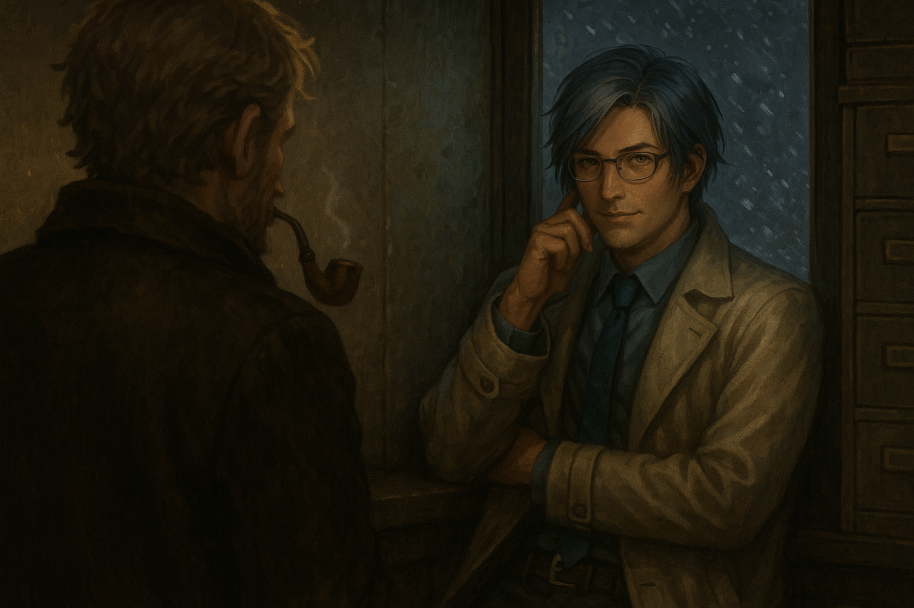

[上一篇](./守塔人笔记15.md)    [合集](../同人目录.md)

# 守塔人笔记

作者：Arce（mouyains）

* [0](./守塔人笔记00.md)
* [1](./守塔人笔记01.md)
* [2](./守塔人笔记02.md)
* [3](./守塔人笔记03.md)
* [4](./守塔人笔记04.md)
* [5](./守塔人笔记05.md)
* [6](./守塔人笔记06.md)
* [7](./守塔人笔记07.md)
* [8](./守塔人笔记08.md)
* [9](./守塔人笔记09.md)
* [A](./守塔人笔记10.md)
* [B](./守塔人笔记11.md)
* [C](./守塔人笔记12.md)
* [D](./守塔人笔记13.md)
* [E](./守塔人笔记14.md)
* [F](./守塔人笔记15.md)
* [Ω](./守塔人笔记16.md)
* [番外：夜店野郎](./守塔人笔记番外.md)

## Ω

“所以，你的意思是说，我的血脉起源、那条叫做伊锡立翁的龙，现在正在名为英国的国家当音乐老师。”

“对。”

“事业有成，但追自己学生追了五六年，最亲密的互动只有同席喝酒同车回家……你们称这种状态为柏拉图？”

阿拉斯加，某小型军事基地，档案室。

右脸纹龙的杉型人偶阿斯克对着手里的背调资料，嘴角抽搐，与档案室旧日光灯管的频闪配合无间。

给他递这份资料的是基地负责人“主教”，这人本来正倚着资料柜抽烟斗，但当阿斯克提及“伊锡立翁”的感情生活时，主教几乎只用了一秒就换出如丧考妣的悲怆脸。

“嗯，对。”主教的“对”念出了咬牙切齿的感觉。

阿斯克立刻闭上眼睛，深吸一口气，再缓缓吐出。“操。那完蛋了。”

“谁让他那个学生家里真有个皇位要继承呢？我当初给上面交的前瞻计划里规划得很好，按原本的预想，这俩的孩子该在今年出生。”主教胡乱吐着烟圈，“现在我每天都在等上面彻底坐不住、一张缉捕令批下来，抓这对急死人的柏拉图去实验室配种。”

“你们就抓吧。这事如果是我遇上的，那从狗上司到你派的狗执行人我都要揍一遍，揍完还得往你们屁眼子里塞上面包棍。权力结构不优化，决策全靠拍脑门，管人管去下半身，就这种政治体，迟早得烂。”

阿斯克将手上的资料递回给主教，“可以理解你准备单干的想法了。”

主教用牙叼紧了烟斗，手上数了遍纸质资料的页数，数到一半瞥了一眼站在他面前的阿斯克，这人正双手抄兜，左腿抖得很有节奏。

“那，你要加入我吗？”

“没问题。反正我自从来到这，两眼一睁就是玩电脑游戏，真不如跟着你弄点事做，顺便学学怎么搞政斗。我之前在另一个位面一直干技术岗，没太正经研究过怎么玩人心。”

主教将那一叠纸塞进了手边的碎纸机，“其实我希望你继续做技术岗，你的人偶实在有趣。”

“哎——”阿斯克娴熟地扭出可怜巴巴的表情，“我连代号都想好了，你跟我说我得接着天天蹲实验室？算了，总之我想叫异教（Proselyte），就这么定了哈！”

主教差点没叼住烟斗，一缕烟气直呛进他肺管子里。“你——咳咳，你是知道我叫主教、故意呛我，还是《尤里的复仇》玩多了？”

“都有。”

阿斯克，或者说，异教吸了吸鼻子，脸早转回了最初平淡的样子。他转头看向窗外，阿拉斯加的北风裹着雪块，压得玻璃窗吱嘎作响，盖过了碎纸机运作的声音。

[上一篇](./守塔人笔记15.md)    [合集](../同人目录.md)
